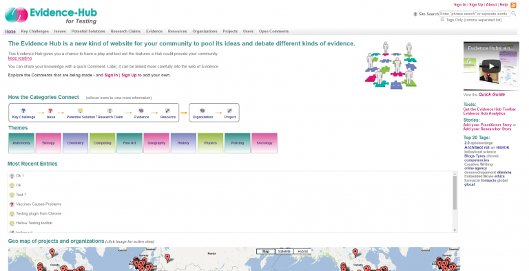
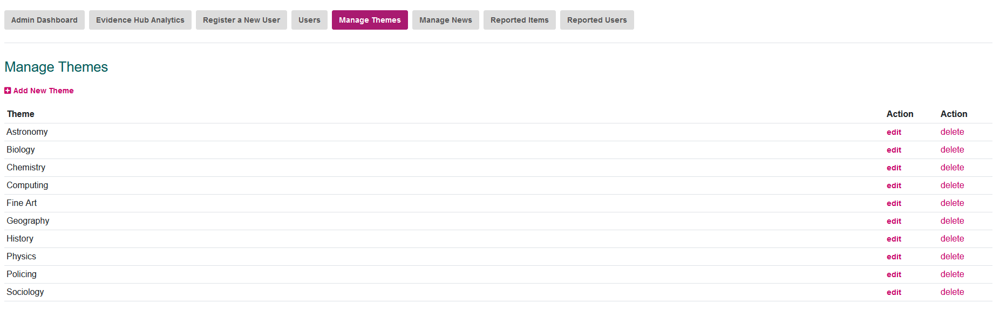

# Evidence Hub Documentation

> [!IMPORTANT]  
> This code base is no longer in active development. The majority of the code was originally developed between 2010 and 2012 with various updates and tweaks over the following years. So, a lot of the code is old in style and development practises.

> [!WARNING]  
> Some of this documentation may be out-of-date.

## Contents

*   [Overview](#overview)
*   [License](#license)
*   [System Requirements](#system-requirements)
*   [Folders](#folders)
*   [Setting up an Evidence Hub](#setting-up-an-evidence-hub)
*   [Sites Config Settings](#sites-config-settings)
*   [Language](#language)
*   [Tailoring your Evidence Hub](#tailoring-your-evidence-hub)
*   [Additional Developer Notes](#additional-developer-notes)
*   [Introduction to using an Evidence Hub](#introduction-to-using-an-Evidence-Hub)
*   [Case Studies](#case-studies)

## Overview

<figure>
  
  <figcaption>An example Evidence Hub homepage</figcaption>
</figure><br/><br/>

The Evidence Hub concept reflects our need for better ways to pool, map and harness what a community knows. The Evidence Hub is a collaborative knowledge-building (specifically evidence-building) web platform. It was designed in KMi by the team developing the concept of “Contested Collective Intelligence” [1,2], where it is important to understand different perspectives and support quality debates. The first Evidence Hub was developed for the Open Learning Network project [3], and further refined in the Communities of Practice for Health Visiting project [4]. 

An Evidence Hub provides novel visual analytics designed to give insight into, and provoke reflection on, users’ knowlege-building activity. It is designed for use by practitioner communities/networks engaged in informal learning, and by students in more formal educational contexts. 

The Evidence Hub is designed to answer questions such as: 

 • Who in my region is working on this problem? 

 • Are there any partnerships between projects in these two areas, on this theme? 

 • What are the key challenges we’re facing? 

 • Who has potential solutions to these, and what’s the evidence that they work? 

 • What evidence-based claims can we make with confidence? 

 • What are the most controversial issues? 

<b>References</b>

[1] De Liddo, Anna; Sándor, Ágnes and Buckingham Shum, Simon (2012). Contested Collective Intelligence: rationale, technologies, and a human-machine annotation study. Computer Supported Cooperative Work (CSCW), 21(4-5) pp. 417–448. http://oro.open.ac.uk/31052 

[2] De Liddo, Anna and Buckingham Shum, Simon (2013). The Evidence Hub: harnessing the collective intelligence of communities to build evidence-based knowledge. In: Large Scale Ideation and Deliberation Workshop, 29 June – 02 July 2013, Munich, Germany. http://oro.open.ac.uk/38002 

[3] De Liddo, Anna; Buckingham Shum, Simon; McAndrew, Patrick and Farrow, Robert (2012). The open education evidence hub: a collective intelligence tool for evidence based policy. In: Cambridge 2012: Joint OER12 and OpenCourseWare Consortium Global 2012 Conference, 16 – 18 April 2012, Cambridge, UK. http://oro.open.ac.uk/33253 

[4] Ikioda, F. , Kendall, S. , Brooks, F. , De Liddo, A. and Buckingham Shum, S. (2013) Factors That Influence Healthcare Professionals’ Online Interaction in a Virtual Community of Practice. Social Networking, 2, 174-184. http://dx.doi.org/10.4236/sn.2013.24017 


## License

The Evidence Hub code base is released under the LGPL license: [http://www.fsf.org/licensing/licenses/lgpl.html](http://www.fsf.org/licensing/licenses/lgpl.html).  
It includes third party code which should all have licenses which are compatible with LGPL (see **/core/lib** and **/ui/lib** folders to view third party libraries used)

## System Requirements

The Evidence Hub code was most recently on a Red Hat Enterprise Linux Server release 8.10 (Ootpa) using:  

### Apache 2.4.37.

Please add the following in your Apache config:  
  
`Options All -Indexes -MultiViews   RewriteEngine on   AllowOverride FileInfo AuthConfig`  
  
If you have .htaccess files disabled (AllowOverride none), it will not affect the running of the site.  
Our .htaccess file has the following:  
  
```
<IfModule mod\_deflate.c>
AddOutputFilterByType DEFLATE text/plain
AddOutputFilterByType DEFLATE text/html
AddOutputFilterByType DEFLATE text/xml
AddOutputFilterByType DEFLATE text/css
AddOutputFilterByType DEFLATE text/javascript
AddOutputFilterByType DEFLATE text/x-js
AddOutputFilterByType DEFLATE application/xml
AddOutputFilterByType DEFLATE application/xhtml+xml
AddOutputFilterByType DEFLATE application/rss+xml
AddOutputFilterByType DEFLATE application/javascript
AddOutputFilterByType DEFLATE application/x-javascript
AddOutputFilterByType DEFLATE application/json
AddOutputFilterByType DEFLATE application/ld+json
AddOutputFilterByType DEFLATE image/svg+xml
AddOutputFilterByType DEFLATE font/truetype
AddOutputFilterByType DEFLATE font/opentype
AddOutputFilterByType DEFLATE application/vnd.ms-fontobject
</IfModule>

#RewriteEngine on
#RewriteCond %{REQUEST\_URI} !/index-maintenance.php$
#RewriteRule $ /index-maintenance.php \[R=302,L\]

ErrorDocument 404 /404-error-page.php
ErrorDocument 403 /403-error-page.php
```

So we use it to compress files to speed up the website and for having site specific 404 and 403 pages.  
We also uncomment the commented out three lines if we want to put the hub into maintenace mode and display a holding page to the user (index-maintenace.php)  
  

### PHP version 7.4.33

Modules installed:  
`bcmath,bz2,calendar,Core,ctype,curl,date,dba,dom,enchant,ereg,exif,fileinfo,filter,ftp, gd,gettext,gmp,hash,iconv,imap,intl,json,ldap,libxml,mbstring,mcrypt,memcache,mysql,mysqli,odbc,openssl,pcntl,pcre,PDO,pdo_mysql,PDO_ODBC,pdo_pgsql,pdo_sqlite,pgsql,Phar,phpcups,posix, pspell,readline,recode,Reflection,rrdtool,session,shmop,SimpleXML,snmp,soap,sockets,SPL,sqlite3,standard, sysvmsg,sysvsem,sysvshm,tidy,tokenizer,uuid,wddx,xml,xmlreader,xmlrpc,xmlwriter,xsl,zip,zlib`  
  
The Evidence Hub is not necessarily dependent on all these modules. These are just the modules installed on the server The Evidence Hub was most recently on. 
I am unsure at this stage if any of them are non standard, or if the Evidence Hub code in anyway replies on them. So, just in case, I am listing them.  
  
NOTE: In your php.ini make sure set allow-url-fopen = on.  

### MySQL

The Evidence Hub uses MySQL/MariaDB as the database at present.So you will need to install MySQL on your server. 
We have most recently tested on mysql Ver 15.1 Distrib 10.3.39-MariaDB. 
The database layer of the code has been abstracted out somewhat to make it eaiser for a developer to extend the Evidence Hub code base to use a different database.  

### Email

The Evidence Hub uses emails to tell users their registration is successful etc. and send out email digests of items or people they are following. 
So your server should be able to do emailing if you want these to be sent. You can switch off emailing with a setting in the config file if required (see [Sites Config Settings](#sites-config-settings), below), but then all user accounts would need to be setup and validated by hand.  

### Crons

To send out the digest emails you will need to setup three cron jobs. An example is shown below. To use the lines below you need to add the file system path to your Evidence Hub code where indicated:  
  
  
0 1 \* \* 4 php `path to code`/core/cron/cron-follow-weekly.php `domain name`  
  
0 1 25 \* \* php `path to code`/core/cron/cron-follow-monthly.php `domain name`  
  
0 2 \* \* \* php `path to code`/core/cron/cron-follow-daily.php `domain name`  
  
0 \* \* \* \* php `path to code`/core/cron/cron-follow-hourly.php `domain name`  
  
0 0 15 \* \* php `path to code`/core/cron/cron-recent-activity.php `domain name`

  

## Folders

The top level of the file structure has the config.php file, (see [Sites Config Settings](#sites-config-settings), below) and the setup.php file.

This level also has the files for the other main context pages of the site: index (for the global context) explore (for the item context), user, search and the fav icon etc..

**The Folders:**

*   **admin** \- This folder has various files that run the activity digest email cron jobs, hold the administer themes page, the register new user form, the user statistics page etc.. If you are a user who has the 'IsAdministrator' field in the Users table set to 'Y', you will see an extra menu item when logged in at the top of the screen called 'admin'. This page currently only has the 'Register New User' link. In future releases it will have more.  
      
    If you are logged in as the Site admin user (see `$CFG->ADMIN_USERID` in the [Sites Config Settings](#sites-config-settings) section below), you will see a 'Manage Themes' option to allow you to add, edit and delete system Themes. This should really only be done before a hub is up an running. Be very careful deleting or editing Themes once people have started using them. Think about the consequesnces carefully.
*   **api** \- This folder holds the Evidence Hub services file that processes incoming service request, (see core/apilib.php for the actual guts).
*   **core** \- This is where the server side code resides.
    *   **database** \- This holds the database manager and the sql statements. There is a README.txt file in there with more details.
    *   **datamodel** \- This holds that classes that hold that database record information when it is loaded. There are classes for all the mail items types, like user, node, linktype etc...
    *   **formats** \- This holds the files that process the api return data into the correct format, e.g. json, xml etc..
    *   **lib** \- This holds all the external libraries that the evidence Hub is using in the server side code.
*   **docs** \- This is where there are some additinal developer docs.  
    **Once you have finished the install process you may want to remove this folder from your website.**
*   **help** \- This is where the help pages are. But the actual text can be found io the language folder.
*   **images** \- This is where all the graphics for the site are.
*   **install** - This folder has setup notes, the sql file needed to create a Evidence Hub database and the script to install the default data. See [Setting up an Evidence Hub](#setup) below.  
    **Once you have finished the install process remove this folder from your website.**
*   **io** \- This folder holds the code to handle the import options in the Evidence Hub: currently just from [Compendium](http://compendium.open.ac.uk/institute).
*   **language** \- This folder holds the language files for all the interface text. By changing the $CFG->language property (see below) you can override the default language of 'en' and add a different folder and then convert all the language files to another language if you want to. For more details on how this works see [Language](#lang) below.
    *   **en** \- This holds the default English language version of all interface text shown to the user. Please never remove this folder.
        *   **custom** \- This folder will intially be empty, and is where you will place any site specific text overrides, (see [Site specific text](#sitetext) below).
*   **sites** - There is a README.txt file with more details
    *   **default** - This is where you setup a sinlge instance or the base instance of the site. There is a README.txt file there with more details.
    *   **multi** - This is where you setup multiple instance of the site for different domains, but sharing the codebase. There is a README.txt file there with more details.
*   **themes** - This is where you can setup alternative themes. We supply the Default theme. It has a sub-folder for images and one for the stylesheets. Please see the README.txt file that is in the themes folder for more details about setitng up themes.
*   **ui** - This folder has most of the client side code e.g. header, footer, sidebar etc.
    *   **explore** \- This holds that classes that create the debate and widget explore pages.
    *   **geomaps** \- This holds the files that produce the geographic map pages
    *   **lib** \- This holds all the external libraries that the evidence Hub is using in the client side code.
        *   **DataTables** - This folder holds the library that handles data tables within the site
        *   **bootstrap** - This folder holds bootstrap
        *   **ckeditor** - This folder holds the library that handles the html wysiwig editor displayed in forms.
        *   **datetimepicker** - This folder holds code to create a date/time picker popup
        *   **jit-2.0.2** - This folder holds code that draws the network maps.
        *   **kcfinder** - This is used to manage web files uploaded through CKeditor
    *   **networkmaps** \- This holds the files that create all the network applet pages. It also has the subfolder holding the java applet jar files.
    *   **pages** \- This holds the secondary page files, like login and logout, register, conditionsofuse etc..
    *   **popups** \- This holds the files that are shown in popup windows, like the add and edit forms, the story forms, the print pages etc..
    *   **stats** \- This holds the code that draws some of the dahsboard graphs.

  
## Setting up an Evidence Hub

### Creating the Database

Create an empty database for the Evidence Hub to use in your MySQL installation, making sure that the database character set and collation are UTF-8, e.g.  
`CREATE DATABASE dbname CHARACTER SET utf8 COLLATE utf8_general_ci;`  
          
If you do not want to use utf8, you will need to edit the db.sql file before you run it in c. below, as the table creation statements are using utf8.
Next create a MySQL user for the Evidence Hub to use. Lastly, load the database schema from /install/db.sql into your new Evidence Hub Database to create all the required tables.

#### Adding the Default Data:

1. Edit /install/adddefaultdata.php. You must fill in the following data in the file:
    *   $dirAddressUploads = the file path to the uploads folder, which must end in '/', (further notes in adddefaultdata.php)
    *   $databaseaddress = the address of your mysql database - usually localhost;
    *   $databaseuser = the username of your mysql user for the Evidence Hub, as created in step 1b above;
    *   $databasepass = the password of your mysql user for the Evidence Hub, as created in step 1b above;
    *   $databasename = the name of your mysql database for the Evidence Hub, as created in step 1a above;
    *   $email = fill in a default user email address for the Evidence Hub - this can be made up. This user account owns the default node and links types and acts as a template for all subsequent user accounts;
    *   $password = fill in an default user password for the Evidence Hub;
    *   $email2 = fill in a theme admin user email address for the Evidence Hub - this can be made up. This user account manages the Evidence Hub Themes list and is called the System Admin user.
    *   $password2 = fill in an theme admin user password for the Evidence Hub;
<br/>

2.  Edit /install/adddefaultdata.php some more. You must decide now if you want to change the Evidence Node types supplied in this file.  
    If you do, edit the appropriate section of this file which has the heading 'Evidence Types'.  
    We supply four Evidence Types by default - Anecdote, Case Study, Policy, Research Finding and Report.  
    You can edit any of these or add more.  
    <br />    
    To add another Evidence node type you will need to decide/create an icon and place it in 'images/nodetypes/Default' add additional lines of code in adddefaultdata.php. Examples of the code and further instructions can be found in the adddefaultdata.php file. If you add more Evidence Types, please make sure you also add a new line for each new Evidence Type in the 'Evidence Types into the Evidence Group' section of adddefaultdata.php file.  
    <br/>
> [!NOTE]  
> If you ever need to add a new Evidence Type after this file has been run, make sure you add it to the database against the default user account and then any other Users accounts that exist at that time. And also add it to the Evidence NodeTypeGrouping table for the approprate Evidence Group.
<br/>

3.  Now run the adddefaultdata.php file on your server. You can do this in two ways:    
    1.  Run it from the command line. Note that the file will output data that you will need, specifically two UserIDs (as well as possible error messages). You can get the user ids you will need from the database Users table if required.
    2.  Surf to the file through your browser. In this case the two user id's will be displayed on screen as will any error messages.When it completes (hopefully without error) make a note of the ids it displays. You will need these in a moment to put in the Config file.

> [!IMPORTANT]  
> Remove the **install** folder from your running website, once you have completed the database setup.


### Setting up the Configuration files.

There are three configuration files you will need to setup. Each has an '_template' version for you to config and edit:

1. Copy `/config_template_.php` to `/config.php`

You will need to edit the config.php file here to just add two things:
    a.  `$CFG->basedomain` - this is the domain that is the default one for the installation. If you are running this as a single site this will be your actual domain. For multi-sites you still need a base domain entered here. The details config.php file for this base domain can be found in 'sites/default/'.
    b.  `$CFG->dirAddress` - this is the file path on your server to the website code, ending in a '/'

2. Copy /`setup_template.php` to `/setup.php` 

Mostly there is nothing you need to change here. If you want to see maps within the platform you will need to set a url to an Open Street map tile cache services against the property `$CFG->maptilesurl`. We used to use Google maps before they started charning. The legacy property still exists in the file `$CFG->GOOLGE_SERVER_SIDE_API_KEY` but it is no longer used.

3. Copy `/sites/default/config_template.php` to `/sites/default/config.php`

Edit settings in sites/default/config.php to point to your set up and database and to configure other important aspects of the Evidence Hub site. For the setting `$CFG->ADMIN_USERID`, `$CFG->defaultUserID` and `$CFG->defaultRoleGroupID` you will need to copy in the ids generated when setting up the default data in the database.  All config file settings are explained below in [Sites Config Settings](sites-config-settings).  


At this point you should be able to surf to the website and check it comes up OK. It will, of course, have the default supplied look and feel (using any header icon you have specififed in the config), but you can at least test that all is working thus far.

### Setting up the Themes

To complete the default data your Evidence Hub will need, you now need to add the Themes specific to your domain.

1.  Login as the System Admin user (using the details you used in setting up the database default data above).
2.  You should now see an 'Admin' link at the top-right of the website. Click on this link.
3.  On the admin page click on the 'Manage Themes' link.
4.  This opens a new window with the Theme Manager in. You can now add the Themes you want to use for your Evidence Hub. While you can always add themes later on, think carefully about editing and deleting them, once they are in use.

<figure>
  
  <figcaption>Example set of themes for an Evidence Hub</figcaption>
</figure>

## Sites Config Settings

Below are more details about the site specific configuration file propertes (`/sites/default/config.php` or `/sites/multi/<domain>/config`)

All setting have comments explaining their use.  
  
**`$CFG->privateSite = false;`**  
( Does this site require login for all access, including interface and API; true if it does, else false if it does not. This basically would lock down the site for access by non-logged in users. You would need to really edit the login page to make it more of a landing page if you choose to set this to 'true', as the login page would be what people initally always see. ).  
  
**`$CFG->START_DATE = mktime(0, 0, 0, 01, 01, 2016);`**  
( This is the date you setup your Hub. It is currently used by the site Analytics. E.g. mktime(0, 0, 0, 7, 01, 2016) = 1st July 2016 ) just edit the last three number month, date, year).  
  
**`$CFG->SITE_TITLE = "The title of your Evidence Hub";`**  
( This is used in the header title as well as being displayed to the user in various places. )  
  
**`$CFG->ADMIN_USERID = "the database user id number of your System administrator";`**  
( This person is the owner of the Theme nodes in the system and you have to log in as them to manage themes.)  
  
**`$CFG->defaultUserID = "the database user id number of your Default user";`**  
( This person acts as a template for new users. Thier node and link types are copied into new user accounts.)  
  

### Node Types

**`$CFG->BASE_TYPES = array("Challenge","Issue","Solution","Claim","Organization","Project","Theme");`**  
( These are the basic node types for the Evidence Hub Datamodel. There is some flexibility. You can if you chose remove Challenge. You can also choose to remove either Solution or Claim, but not both. If you remove both the site will not work. If you remove any other node types the site will not work properly.)  
  
**`$CFG->EVIDENCE_TYPES = array("Anecdote","Case Study","Policy","Research Finding");`**  
( These are the default Evidence Types. If you have changed them when you installed your default data please edit these to be exactly the same as your Evidence Type names in the database. )  
  
**`$CFG->RESOURCE_TYPES = array("Publication","Web Resource");`**  
( These are the default Resource Types. If you have changed them when you installed your default data please edit these to be exactly the same as your Resource Type names in the database. )  
  
**`$CFG->EVIDENCE_TYPES_DEFAULT = "Anecdote";`**  
( This is the default Evidence Type selected in the interface. This must match one of the Evidence Types listed in the EVIDENCE\_TYPES property above. )  
  
**`$CFG->RESOURCE_TYPES_DEFAULT = "Web Resource";`**  
( This is the default Resource Type selected in the interface. This must match one of the Resource Types listed in the RESOURCE\_TYPES property above. )  
  

### URL Setup

**`$CFG->homeAddress = "http://web/path/to/website/";`**  
( home address is the base url for the website and must end with trailing '/' )  
  

### Database Setup

**`$CFG->databaseaddress = "localhost";`**  
(The database address, e.g. localhost or a url etc.)  
  
**`$CFG->databaseuser`**  
(The database username that Cohere uses to login to the database)  
  
**`$CFG->databasepass`**  
(The database password to go with the above username)  
  
**`$CFG->databasename`**  
(The database name for the Evidence Hub is to use)  
  

### Language

**`$CFG->language = 'en';`**  
(This string indicates what language the interface text should use. The name must correspnd to a folder in the 'language' folder where the translated texts should exist.)  
For more information about the language system please see [Language](#lang) below.  
  
**`$CFG->defaultcountry = "United Kingdom";`**  
(Country name as it appears in the language/<your language as above>/countries.php list to used as the default selection in Countries menus. If you change the language used you must also change this text.)  
  

### Interface Theme

**`$CFG->uitheme = "default";`**  
(This string indicates what theme the interface should use. The name must correspond to a folder in the 'theme' folder where the theme specific style sheets, images and pages should exist. The default theme is 'deault'. Make sure this is never deleted as it is the fall back position.)  
  

### Bits and Pieces

**`$CFG->workdir = "/tmp/"`**  
(The path to a temp directory that Evidence Hub can use)  
  
**`$CFG->build_from_permissions = $CFG->BUILD_FROM_COMMENTS_ALL;`**  

(This paramter dictates who can build a new item from a Chat or Open Comment:  
There are three option you can change this parameter to.  
`$CFG->BUILD_FROM_COMMENTS_USER`, where only the Owner of a chat or open comment can build another item from it  
`$CFG->BUILD_FROM_COMMENTS_ADMIN`, where only the Owner of a chat or open comment, or an Admin person can build naother item from it  
`$CFG->BUILD_FROM_COMMENTS_ALL`, where anyone logged in can build naother item from it  
The default is `$CFG->BUILD_FROM_COMMENTS_ALL`)  
  
**`$CFG->areStatsPublic = true;`**  
(Should the site stats be visible to everyone - set to true, or just the Admins - set to false. Default is true;)  
  
**`$CFG->hasRecommendations = true;`**  
(If true, it draw recommedation widgets on the explore pages. If false, it does NOT draw recommendation widgets on the explore pages.)0  
  
**`$CFG->autoFollowingOn = false;`**  
(If true, all users will automatically follow thier own items. If false, they will not).  
  
**`$CFG->hasSocialTab = false;`**  
(If true, it draw Organizations/Projects/Users as one tab called 'Social' with a rollover menu for the three options. If false, it draws them as separate tabs.)  
  
**`$CFG->issuesManaged = false;`**
(If true, only admins can add new issues. Default is false.)

**`$CFG->hasIssueDebateView = false;`**
(If true, it shows the debate button on explore for Issues. False to not show. Defaults to false)

**`$CFG->hasStories = true;`**
(Does the hub have the link to the Story forms or not; default is true)

**`$CFG->hasRss = true;`**  
(If true, you get RSS feed buttons at various places in the site. If false, you get no RSS feed buttons.)  
  
**`$CFG->hasCompendiumImport = false (or true);`**  
(Does this site want to use a Compendium import. Note: the default import may need to be modified to match any site specific changes like new Evidence Types. )  
  
**`$CFG->hasUserHomePageOption = false (or true);`**  
(Does this site want to have the homepage field on the user registration/profile forms. )  
  
**`$CFG->hasConditionsOfUserAgreement = false (or true);`**  
(Does this site want to display a Conditions of use Agreement statement when user's sign up? The default text for this can be overriden in the language custom folder.)  
  
**`$CFG->homeTagCount = 20;`**  
(How many tags to show in the home page tag cloud. We set 20 as the default.)  
  

The following two values work together.  
For example if the debateCountOpen is 1 and the debateChildCount Open is 10, then on the knowledge builder explore page, a knowledge tree will be opened automatically when the page is loaded only if there is only 1 tree with less than 10 items on it, otherwise trees will be closed.

**`$CFG->debateCountOpen = 1;`**  
(this value determines how many knowledge trees there should be to decide if they should be opened automoatcially.)  
  
**`$CFG->debateChildCountOpen = 10;`**  
(This value determines how many items they should be less than in a knowledge tree to open it automatically.)  
  

The following two values work together.  
For example if the chatCountOpen is 1 and the chatChildCount Open is 15, then on the Chats explore page, a chat tree will be opened automatically when the page is loaded only if there is only 1 tree with less than 10 items on it, otherwise trees will be closed.

**`$CFG->chatCountOpen = 1;`**  
(this value determines how many chat trees there should be to decide if they should be opened automoatcially.)  
  
**`$CFG->chatChildCountOpen = 15;`**  
(This value determines how many items they should be less than in a chat tree to open it automatically.)  
  
**`$CFG->chatPollingOn = true;`**
(Whether the Chat pages should have polling refreshing on or off)

**`$CFG->chatPollingInterval =  60000;`**
(If chat polling is on, this is the refresh rate in milliseconds.Defaults 60000 = 1 minute)

**`$CFG->welcomeMovie = "http://www.youtube.com/watch?feature=player\_embedded&v=0fB2Kd2La8g";`**  
(We supply a default movie about the Evidence Hub. If you want the Homepage to show a different movie, change this link.)  
  

### Site Registration

**`$CFG->signupstatus = $CFG->SIGNUP_CLOSED;`**

(Whether or not the site is open for registration. There are three option you can change this parameter to:  
`$CFG->SIGNUP_OPEN`, If you use this state for signup, then users can register themselves for using the Hub  
`$CFG->SIGNUP_REQUEST`, If you use this state for signup below, then users can request an account for using the Hub which is then validated by a Hub Admin user.  
`$CFG->SIGNUP_CLOSED`, If you use this state for signup below, then users cannot register, they must be sent login details. So by invitation only.  
The default is `$CFG->SIGNUP_CLOSED`)  
  
**`$CFG->signuprequestemail = ''; // defaults to $CFG->EMAIL_REPLY_TO`**
(The email address of the Hub user managing the registration requests if SIGNUP\_REQUEST is used. They must be ad admin user (IsAdmin set to 'Y' in Users table the database))  
  

### Background colours used in the Network Applet

These are the background colours used in the Network drawings.  
They have the same names as styles in the styles.css file, but we found we needed slightly darker shades than their stylesheet equivalents.  

``` 
$CFG->challengebackpale = '#6FCBF5';
$CFG->issuebackpale = '#C6ECFE'; 
$CFG->solutionbackpale = '#FCD7BE'; 
$CFG->claimbackpale = '#F0B288';  
$CFG->orgbackpale = '#A4AED4';  
$CFG->projectbackpale = '#DEE2F0';  
$CFG->peoplebackpale = '#EAECF5';  
$CFG->evidencebackpale ='#DFC7EB';  
$CFG->resourcebackpale = '#E1F1C9';  
$CFG->themebackpale = '#FAB8DA';  
$CFG->plainbackpale = '#D0D0D0';  
```  
These are the background colours used in Analytics graphs  
They need to be darker versions of the above colours, as the pale versions are too pale on a graph.  

```  
$CFG->challengeback = '#067EB0';  
$CFG->issueback = '#4CC1F2'; 
$CFG->solutionback = '#F2B48A'; 
$CFG->claimback = '#CD6119'; 
$CFG->orgback = '#5B70BD'; 
$CFG->projectback = '#94A5E4'; 
$CFG->peopleback = '#0000C0';
$CFG->evidenceback ='#BC84DC'; 
$CFG->resourceback = '#BCE482'; 
$CFG->themeback = '#F777B9'; 
$CFG->plainback = '#D0D0D0'; 
```  

### Browser Bookmarklet Tool

> [!WARNING]  
> The Bookmarklet Tool no longer functions on many sites.

**`$CFG->buildername = "-Your Site- EH";`**  
(The name of the Tool for this site. A shortening of the main site name or something like that.)  
  
**$`CFG->buildernamekey = "<your tool key - e.g. 'EvHub'>";`**  
(This needs to be a unique **single word** key that is used before all function names in the tool to avoid clashing with any other scripts loaded in wepages.)  
  

### For initializing the org geo map

These default settings show the world, zoomed out.  
  
**`$CFG->orggeomapdefaultlat = "17.383";`**  
(The latitude to center the Organization/Project map on)  
  
**`$CFG->orggeomapdefaultlong = "11.183";`**  
(The longtitude to center the Organization/Project map on)  
  
**`$CFG->orggeomapdefaultzoom = "2";`**  
(The zoom level to start Organization/Project map on. 12 is quite zoomed out. )  
  

### For initializing the user geo map

These default settings show the world, zoomed out.  
  
**`$CFG->usergeomapdefaultlat = "17.383";`**  
(The latitude to center the User map on)  
  
**`$CFG->usergeomapdefaultlong = "11.183";`**  
(The longtitude to center the User map on)  
  
**`$CFG->usergeomapdefaultzoom = "2";`**  
(The zoom level to start the User map on. 12 is quite zoomed out.)  
  

### For initializing the user entries geo map

These default settings show the world, zoomed out.  
  
**`$CFG->usernodegeomapdefaultlat = "17.383";`**  
(The latitude to center the User map on)  
  
**`$CFG->usernodegeomapdefaultlong = "11.183";`**  
(The longtitude to center the User map on)  
  
**`$CFG->usernodegeomapdefaultzoom = "2";`**  
(The zoom level to start the User map on. 12 is quite zoomed out.)  
  

### Emailing

**`$CFG->send_mail = true;`**  
(whether or not to send emails. For example if your server can't do emailing - true/false, default 'true')  
  
**`$CFG->EMAIL_FROM_ADDRESS = "";`**  
(The email address to show system emails as being sent from)  
  
**`$CFG->EMAIL_FROM_NAME = $CFG->SITE_TITLE." Admin";`**  
(The email from name to show system emails as being sent by. Defaults to your site title plus 'Admin')  
  
**`$CFG->ERROR_ALERT_RECIPIENT = "";`**  
(The email address to sent system error alerts to. Usually your developer.)  
  
**`$CFG->EMAIL_REPLY_TO = "kmi-edfutures@open.ac.uk";`**  
(The email address to show system emails should be replied to)  
  

### Newsletters and Email Digests

**`$CFG->RECENT_EMAIL_SENDING_ON = true;`**  
Should recent activity email sending should be included in this hub? (true/false);  
  
**`$CFG->RECENT_EMAIL_SENDING_SELECTED = 'Y';`**  
If recent activity email sending should be on or off by default for new user ('Y' == on / 'N' = off);  
  
**`$CFG->ACTIVITY_EMAIL_SENDING_ON = 'Y';`**  
(If email sending should be on or off by default for new user - 'Y' == on / 'N' = off)  
  
**`$CFG->ACTIVITY_EMAIL_SENDING_INTERVAL = 'daily';`**  
(When to send email alerts by default for new users - 'daily'/'weekly'/'monthly')  
  

### Proxy Settings

if the server needs a proxy to access internet, set it here.  
  
**`$CFG->PROXY_HOST = "";`**  
  
**`$CFG->PROXY_PORT = "";`**  
  

### Captcha

**`$CFG->CAPTCHA_ON` = false;**  
(If you want to use Capthca set this to 'true. ('true' or 'false'))  
If this is set to 'true' you must also complete `$CAPTCHA_PUBLIC` and `CAPTCHA_PRIVATE` below.  
We strongly recommend that you use Captch on your registration forms to stop automated registrations.  
  
**`$CFG->CAPTCHA_PUBLIC` = "add recaptcha public key here";**  
**`$CFG->CAPTCHA_PRIVATE`= "add recaptcha private key here";**  
(If you want to use Captcha on your site, you can get the public and private keys from the Captcha website ([http://www.captcha.net/](http://www.captcha.net/)))  
  

### Google

**`$CFG->GOOGLE_ANALYTICS_ON = false;`**  
(If you want to use Google Analytics set this to 'true. ('true' or 'false'))  
If this is set to 'true' you must also complete the GOOGLE\_ANALYTICS\_KEY below.  
  
**`$CFG->GOOGLE_ANALYTICS_KEY = "";`**  
(Google analytics key: You will need to go and get a Google analytics key for your site, if you want the analytics to work)     

### MailChimp Newsletter System

**`$CFG->MAILCHIMP_ON = false;`**  
(Is MailChimp Newsletter service being used on this hub? - true/false)  
  
**`$CFG->MAILCHIMP_KEY = "";`**  
(The main API Key for the Evidence Hub to use the MailChimp service you have set up)  
  
**`$CFG->MAILCHIMP_LISTID = "";`**  
(The MailChimp List id for the list you have setup for the Evidence Hub to subscribe users to)  
  
**`$CFG->MAILCHIMP_NEWSLETTER_INFO_URL = "";`**  
(If you want to point to an additional page with more information about your newsletter, put the url to use here. If this is empty, the link will not be displayed in the apporpraite pages.)  
  

### Safe URLs

This field is a list of urls that are allowed in IFrame and Object embeds in formatted descriptions.  
To add a new one repeat the pattern but increase the number, e.g. `$CFG->safeurls\[10\] = 'xyz.zom/';` etc..

```  
$CFG->safeurls\[0\] = 'www.youtube.com/embed/';
$CFG->safeurls\[1\] = 'player.vimeo.com/video/';  
$CFG->safeurls\[2\] = 'www.ustream.tv/';
$CFG->safeurls\[3\] = 'www.schooltube.com/';  
$CFG->safeurls\[4\] = 'archive.org/';  
$CFG->safeurls\[5\] = 'www.blogtv.com/';  
$CFG->safeurls\[6\] = 'uk.video.yahoo.com/';  
$CFG->safeurls\[7\] = 'www.teachertube.com/';  
$CFG->safeurls\[8\] = 'sciencestage.com/';  
$CFG->safeurls\[9\] = 'www.flickr.com/';  
```
  

### Link Types

WARNING: Only edit these names if you have also edited them in the database linktype table. The two must match or the Evidence Hub code will not work properly!

```
$CFG->LINK\_SOLUTION\_ISSUE = 'addresses';
$CFG->LINK\_CLAIM\_ISSUE = 'responds to'; 
$CFG->LINK\_ISSUE\_CHALLENGE = 'is related to';
$CFG->LINK\_EVIDENCE\_SOLCLAIM\_PRO = 'supports';
$CFG->LINK\_EVIDENCE\_SOLCLAIM\_CON = 'challenges'; 
$CFG->LINK\_ORGP\_ISSUE = 'addresses';  
$CFG->LINK\_ORGP\_CHALLENGE = 'addresses';
$CFG->LINK\_ORGP\_CLAIM = 'claims';
$CFG->LINK\_ORGP\_SOLUTION = 'specifies';
$CFG->LINK\_ORGP\_EVIDENCE = 'specifies';
$CFG->LINK\_ORGP\_ORGP = 'partnered with';
$CFG->LINK\_ORG\_PROJECT = 'manages';
$CFG->LINK\_COMMENT\_NODE = 'is related to';
$CFG->LINK\_NODE\_THEME = 'has main theme';
$CFG->LINK\_RESOURCE\_NODE = 'is related to';
$CFG->LINK\_NODE\_SEE\_ALSO = 'see also';
$CFG->LINK\_COMMENT\_BUILT\_FROM = 'built from';
``` 
( Leave alone unless you know what you are doing! )  
  

### Default nodetype (role) group id - as found in the database

You will be given these ids when running adddefaultdata.php as part of your install process. If you are upgrading check the values for these in the NodeTypeGroup table in your database.  
  
**`$CFG->defaultRoleGroupID = "";`**  
  
**$`CFG->systemRoleGroupID = "";`**  
  
**`$CFG->evidenceRoleGroupID = "";`**  
  
**`$CFG->resourceRoleGroupID = "";`**  
  

### Spam Alert

**`$CFG->SPAM_ALERT_ON = false;`**  
(If you want to enable spam reporting on this Hub, set the above to 'true'. New interface elements will then display to allow Spam Reporting. If this is set to 'true' you must also complete the SPAM\_ALERT\_RECIPIENT field below)  
  
**`$CFG->SPAM_ALERT_RECIPIENT = "email address of person to receive spam reports";`**  
(If you set spam reporting to true you must then enter the email address that the spam reports should be sent to here.)  
  

### Social Sign On

  
**`$CFG->SOCIAL_SIGNON\_ON = false;`**  
(If you want to allow users to Sign on with external services like Facebook or Twitter change this to 'true'. Before you turn this facility on you must follow the instructions below and obtain ids and secrets for each service you wish to include.)

### Yahoo
```
$CFG->SOCIAL_SIGNON_YAHOO_ON = false;
$CFG->SOCIAL_SIGNON_YAHOO_ID = "";
$CFG->SOCIAL_SIGNON_YAHOO_SECRET = "";
```

1.  Go to [https://developer.apps.yahoo.com/dashboard/createKey.html](https://developer.apps.yahoo.com/dashboard/createKey.html) and create a project.
2.  Fill out any required fields such as the Application name and description.
3.  Set the 'Applcation Type' to be 'Web-based'.
4.  Set the 'Home Page URL' to be you hub url  
    It should match with the current domain given in $CFG->homeAddress minus the final slash.
5.  Int 'Access Scope' select 'This app requires access to private user data'.  
    A section will expand out. Enter the Application Domain as in 4. above.
6.  In 'Select APIs for private user data access:', select 'Social Directory' and leave it as 'Read Public'.
7.  Once you have created the project, copy and paste the 'Consumer Key' as the `$CFG-SOCIAL_SIGNON_YAHOO_ID`  
    and the 'Consumer Secret' as the `$CFG->SOCIAL_SIGNON_YAHOO_SECRET`  
    and set `$CFG->SOCIAL_SIGNON_YAHOO_ON = true`.

### Google
```
$CFG->SOCIAL_SIGNON_GOOGLE_ON = false;
$CFG->SOCIAL_SIGNON_GOOGLE_ID = "";
$CFG->SOCIAL_SIGNON_GOOGLE_SECRET = "";
```

1.  Go to [https://code.google.com/apis/console/](https://code.google.com/apis/console/) and create a new project, if you don't have one.
2.  Fill out any required fields such as the name and description.
3.  Click on "Create client ID..."/"Create another client ID...". This open a popup
4.  Make sure 'Application Type' has 'Web Application' selected.
5.  In the section 'Your site or hostname' fill in your hub url  
    It should match with the current domain given in $CFG->homeAddress minus the final slash.
6.  Then select '(more options)'.
7.  In the section 'Authorized Redirect URIs' you need to add a callback URL for your application:  
    The URL should start with the URL you have entered into $CFG->homeAddress  
    followed by 'core/lib/hybridauth-2.1.2/hybridauth/?hauth.done=Google'  
    e.g. https://test.evidence-hub.net/core/lib/hybridauth-2.1.2/hybridauth/?hauth.done=Google  
    Then press 'Create Client ID'
8.  Once you have done this, copy and paste the 'Client ID' as the `$CFG-SOCIAL_SIGNON_GOOGLE_ID`  
    and the 'Client Secret' as the `$CFG->SOCIAL_SIGNON_GOOGLE_SECRET`  
    and set `$CFG->SOCIAL_SIGNON_GOOGLE_ON = true`.

### Facebook
```
$CFG->SOCIAL_SIGNON_FACEBOOK_ON = false;
$CFG->SOCIAL_SIGNON_FACEBOOK_ID = ""; 
$CFG->SOCIAL_SIGNON_FACEBOOK_SECRET = "";
```

1.  Go to [https://www.facebook.com/developers/](https://www.facebook.com/developers/) and create a new application.
2.  Fill out any required fields such as the application name and description.
3.  Make sure you have 'Sandbox Mode' set to Disabled once your site is live, or only your developer Facebook user will be able to use the Social Sign On.
4.  Select 'Website with Facebook Login' and add your hub url into the 'Site URL' field.  
    It should match with the current domain given in $CFG->homeAddress minus the final slash.
5.  Once you have registered, copy and paste the 'App ID' as the `$CFG->SOCIAL_SIGNON_FACEBOOK_ID`  
    and the 'App Secret' as the `$CFG->SOCIAL_SIGNON_FACEBOOK_SECRET`
    and set `$CFG->SOCIAL_SIGNON_FACEBOOK_ON = true`.

### Twitter
```
$CFG->SOCIAL_SIGNON_TWITTER_ON = false;
$CFG->SOCIAL_SIGNON_TWITTER_ID = "";
$CFG->SOCIAL_SIGNON_TWITTER_SECRET = "";
```

1.  Go to [https://dev.twitter.com/apps](https://dev.twitter.com/apps) and create a new application.
2.  Fill out any required fields such as the application name and description.
3.  Put your website domain in the Application Website and Application Callback URL fields.  
    It should match with the current domain given in $CFG->homeAddress minus the final slash.
4.  Set the Default Access Type to 'Read, Write, & Direct Messages'.
5.  Tick the checkbox beside 'Allow this application to be used to Sign in with Twitter'
6.  Once you have registered, copy and paste the 'Consumer key' as the `$CFG->SOCIAL_SIGNON_TWITTER_ID` 
    and the 'Consumer secret' as the `$CFG->SOCIAL_SIGNON_TWITTER_SECRET` 
    and set `$CFG->SOCIAL_SIGNON_YAHOO_ON = true`.

### LinkedIn
```
$CFG->SOCIAL_SIGNON_LINKEDIN_ON = false;
$CFG->SOCIAL_SIGNON_LINKEDIN_ID = "";
$CFG->SOCIAL_SIGNON_LINKEDIN_SECRET = "";
```

1.  Go to [https://www.linkedin.com/secure/developer](https://www.linkedin.com/secure/developer) and create a new application.
2.  Fill out any required fields such as the application name and description.
3.  Put your website domain in the Website URL field.  
    It should match with the current domain given in $CFG->homeAddress minus the final slash.
4.  Set 'Live Status' to Live (if you are live).
5.  In the OAuth User Agreement section, select 'r_fullprofile' and 'r_emailaddress'
6.  Once you have registered, copy and paste the 'API Key' as the `$CFG->SOCIAL_SIGNON_LINKEDIN_ID`  
    and the 'Secret Key' as the `$CFG->SOCIAL_SIGNON_LINKEDIN_SECRET` 
    and set `$CFG->SOCIAL_SIGNON_LINKEDIN_ON = true`.

  
  

## Language

The current language system allows you to do two important things:

1.  Add another language: You can change the language you are using by translating all the language files into another language.
2.  Site specific text: You can change the text in your version of the hub to be site specific.

### Adding another language

If you want to add a new language set to the Evidence Hub you need to:

1.  Create a new folder inside the 'language' folder whose name the two letter abbreviation for the language you are providing a translation for. These codes are specified by the [ISO 639](http://www.ics.uci.edu/pub/ietf/http/related/iso639.txt) standard, e.g.
    
    _Language Code_
    
    _Language_
    
    `en`
    
    English
    
    `fr`
    
    French
    
    `it`
    
    Italian
    
    `de`
    
    German
    
2.  Copy the language files from inside the default 'en' language folder into your new folder.
3.  Inside any given language file, each item is set up as a key/value pair, in the form key='value'. You must translate/change only the values on the right hand side, NEVER change the key name on the left.
4.  Change the language variables in the config file: `$CFG->language = 'en';` to reflect your new language of choice. The `$CFG->language` setting must match the folder name for your new language.

NB: Some HTML is mixed up in the language files especially in the language heavy areas like the About and the Help pages.

The languagecore.php file contains the node and link names used by other language files. It will always be loaded first so that other language files can reference it.

### Site specific text

To provide site specific text for any of the interface languages you follow this basic pattern:

1.  Locate the term you wish to replace in the language files.
2.  Create a file with the same name as the file containing the term you wish to change but with 'Custom' at the end and place it in the 'custom' folder of the language file you are using. So, for example, if you wish to replace the About page in the English language files, create a file in the 'language/en/custom' folder called 'aboutCustom.php'.
3.  Inside this new file you must use the same key label on the left as in the original file, and then just replace the part on the right after the '=' sign. All domain specific files in the 'sites' language sub-folders are loaded after the main language files, and provided you have used the same keys, the text will be replaced with your version when the language files are loaded.

NOTE: If what you want to change any of the core terms, the names of the categories or links, for example, if you wish to call 'Themes' say 'Topics' instead on your Hub, you can just create a custom languagecore.php file and change the text in that. These terms will ripple through the rest of the interface text as all the rest of the text should reference those terms through their keys. This makes it easy to change the basic terminology for a given Hub community without editing lots of interface text.  
  

**IMPORTANT:** There are two none-standard items in the language folder that are not handled in the same way as the other language files:

1.  The **countries.php** file: This holds the country names used in the location drop-down menus displayed to users. It is also the place where you set your default country when displaying the list ($LNG->DEFAULT\_COUNTRY=). When translating these, please, as with the other files change only the part on the right after the '='. NOTE: this file may need updating if new countries come into existence. The location of where to check for updates is in the file header.
2.  The **mailtemplates** folder: The files inside this folder are used when constructing the emails send out to users. When translating them please change only the words and leave all HTML alone, unless you know what you are doing. Be especially careful about leaving all **%s** items alone. These are replace with specific text when an email is created. So the number of **%s** and their order in the file is very important. Please don't remove any or that email will no longer be written correctly.

  

## Tailoring your Evidence Hub

At present, if you want to change the look and feel or text of your Evidence Hub site, these are the main places you should look at making changes:

*   **Themes:** The style sheets for the user interface can be found in 'themes/default/styles/'. Please don't edit those ones. If you want to create your own theme you should copy the 'default' folder, rename it and edit the styles there. In the images folder you will see some image files like the header logo etc, that you will also probably want to replace. Just make sure the files names and sizes stay the same. In addition you can override themes for a given domain or the default domain in the 'sites' folder. For more information see the README.txt file in the 'themes' folder.
*   **Language:** All text displayed in the Evidence Hub has been placed in various files in the 'language' folder system. So you can override all the default texts your specific site needs. You may especially like to add to or redo the **about** page (language/en/about.php). REMEMBER: never edit the original language files. Always use the Custom file override system. You can also provide sets of language files for other languages. (See the [Language](#language) section of these notes for more details and there is also a README.txt file in the 'language' folder).
*   **Homepage:** The file that draws the homepage (ui/homepage.php) is in the 'ui' folder. While all the text can be changed through the language files, you may want to completely redo this page for your specific Evidence Hub.
*   **Images:** The theme specific images can be found in the themes as mentioned above. All other icons and images can be found in the 'images' folder. If you want to replace an image make sure the size and file name stay the same and you will not need to edit any code. We suggest you backup the images folder before you make changes.
*   **Headers and Footers:** The header and footer files can be found in the 'ui' folder. The main 'header.php' and 'footer.php' do the base site pages, but you will see there are also specific header and footer pages for other parts of the site, like popup dialogs and the stats pages etc., so you may want to look at all of them when making any changes.

  

## Additional Developer Notes

### RESTful API

In theory the Evidence Hub has a RESTful API. The API documentation can be found in the 'docs' folder in the ['code-doc' subfolder](code-doc/index.html).

The API is currently limited to the calls that the Evidence Hub code itself needs to make.  
But in the future we would like to make the API more extensive and add a Developer Key type system to make it more secure.

### Database Schema

As well as the install/db.sql file which has the sql for the database schema, there are two additional documents:

*   ['docs/EvidenceHubDatabaseSchema.htm'](EvidenceHubDatabaseSchema.htm), which describes the schema in an easy to read format.
*   ['docs/EvidenceHubSchema.pdf'](EvidenceHubSchema.pdf), which shows a graphics model of the Evidence Hub database schema and how the tables relate.

### Datamodel Rules

If you are interested in the connection rules for the Datamodel that the Evidence Hub uses these are listed in ['docs/EvidenceHubDatamodelConnectionRules.pdf'](EvidenceHubDatamodelConnectionRules.pdf)

### README

In addition to this document many folders in 'src' have a README.txt file with specifics about areas like 'sites', 'sites/multi', 'sites/default', 'sites/default/custom' etc..

### Translating the Interface

The file [docs/Language-File-Translation-Help.docx](Language-File-Translation-Help.docx) has more specific help for people translating the language files.


## Introduction to using an Evidence Hub

For details on how to use an Evidence Hub instance see: [Introduction to the Evidence Hub](use/intro.md)

## Case Studies

For details on use cases of Evidence Hubs see: [Evidence Hub Case Studies](use/case-studies.md)
